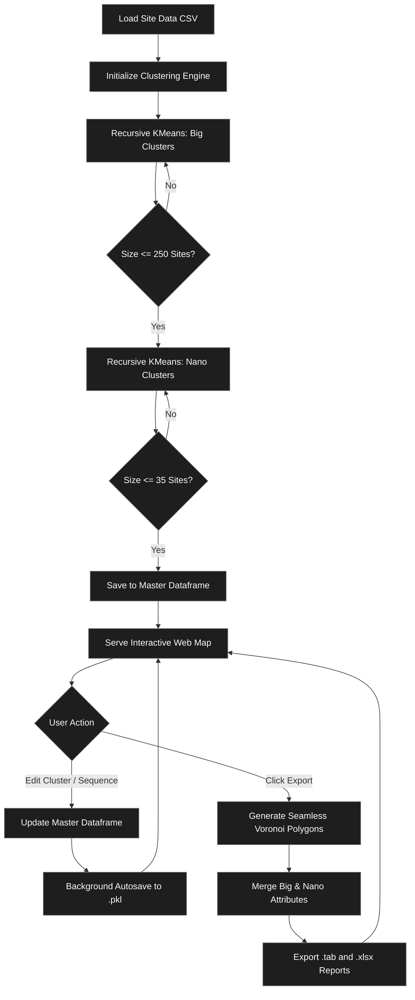

# Dynamic Site Clustering (NR26)

This repository contains a full-stack Flask application and geospatial processing backend for interactively clustering, mapping, and managing telecom site data (specifically for NR26 5G sites).

## Overview
The application handles raw geographical points (sites) and clusters them into high-level "Big Clusters" and localized "Nano Clusters" using a KMeans algorithm based on strict site-count constraints. 



Once initialized, it serves an interactive web interface powered by Leaflet.js where users can:
- Visually inspect Big Clusters and Nano Clusters.
- Dynamically draw optimal paths (TSP approximations) linking cluster centers.
- Manually edit sequence numbers and Region/Zone assignments for individual sites or entire clusters.
- Automatically save progress into a persistent backend state via background API calls.

## Key Features
- **Spatial Clustering:** Enforces hard caps of sites per Big Cluster (~250 sites) and Nano Cluster (~35 sites) without causing the "donut effect".
- **Dynamic Exporting:** Exports edited map data into standard `.xlsx` summary reports and raw MapInfo `.tab` polygon vectors.
- **Combined Polygons:** Generates combined `.tab` polygons partitioned at the Nano level while retaining full Big Cluster attribute inheritance.
- **PyInstaller Compatible:** Designed from the ground up to be compiled into a standalone, single-file Windows Executable (`.exe`) via PyInstaller for offline use.

## Technical Stack
- **Backend**: Python (Flask)
- **Geospatial Processing**: GeoPandas, Shapely, Scikit-learn (KMeans)
- **Frontend**: HTML5, CSS3, JavaScript (Leaflet.js)

## How It Works (The Logic)
1. **Data Ingestion:** Reads the target `.csv` file.
2. **KMeans Initialization:** The script recursively applies KMeans clustering until all clusters fall under their designated site caps. 
3. **State Management:** A `global_df` Pandas DataFrame acts as the singular source of truth. As users make edits on the frontend, JSON payloads are sent to the `/autosave` endpoint, which immediately updates `global_df` and pickles it to disk to prevent data loss.
4. **Voronoi Generation:** During export, `shapely` and `geopandas` are used to generate seamless Voronoi diagrams around site coordinates. These polygons are intersected to form contiguous boundaries for MapInfo exporting.

## Running Locally
```bash
# 1. Install dependencies
pip install pandas geopandas shapely scikit-learn flask folium

# 2. Ensure your target .csv is in the project root
# 3. Start the application
python app.py
```
*(Note: A pre-compiled `.exe` handles all of this automatically if you are using the standalone package.)*
